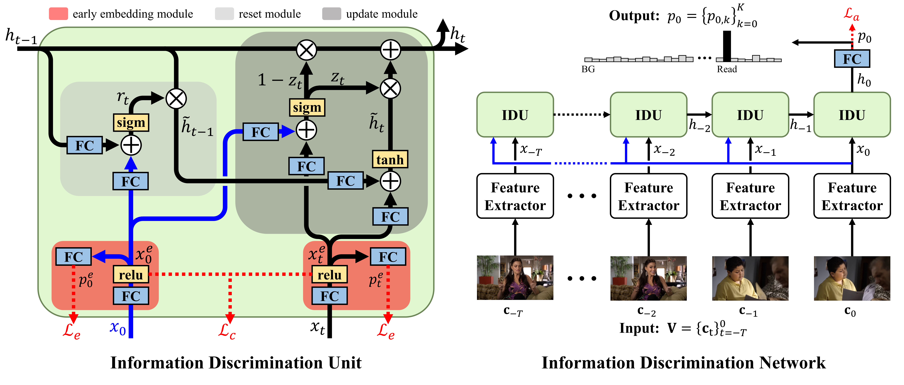

# Information Discrimination Units (IDU)
**Learning to Discriminate Information for Online Action Detection, CVPR 2020**  
Hyunjun Eun, Jinyoung Moon, Jongyoul Park, Chanho Jung, Changick Kim  
[[`arXiv`](https://arxiv.org/abs/1912.04461)]

## Introduction
<div align="center">
  
</div>
This is official implementation of IDU. We investigate on the question of "how RNNs can learn to explicitly discriminate relevant information from irrelevant information for detecting actions in the present". To this end, we propose a novel recurrent unit that
extends GRU with a mechanism utilizing current information and an early embedding module. We perform extensive experiments
on two benchmark datasets, where our IDN achieves stateof-the-art performances of 86.1% mcAP and 60.3% mAP on TVSeries and THUMOS-14, respectively.

## Updates
**30 May, 2020**: Initial commit

## Installation

### Prerequisites
- Ubuntu 16.04  
- Python 3.6.8   
- CUDA 10.0  
- cuDNN 7.5

### Requirements
- tensorflow==1.13.1  
- scipy==1.3.0  

### Patches

## Training
The code for training is not included in this repository, and we cannot release the full training code for

### Datasets
Download our extracted features on RGB and Flow.

### Trained Models
Download trained models on [THUMOS-14](https://drive.google.com/uc?export=download&confirm=8b-Z&id=1DUpOzbLG-8ptpPVJrzsRiKFRIaO1FBcs) and [TVSeries](https://drive.google.com/uc?export=download&confirm=A33G&id=1zJ7EfhQg91XVrV9ryjvmcoyQDEl3U_Fn) in 'dataset name'/logs/'.

## Testing

__For THUMOS-14__  
```
python thumos14/test_idu.py --model_name TFN-ED
```
The code provides the results of our IDN, '__mAP of 55.7%__'.  

__For TVSeries__  
```
python tvseries/test_idu.py --model_name TFN-ED
```
The code provides the results of our IDN, '__mcAP of 85.0%__'.  

## Citing IDU
Please cite our paper in your publications if it helps your research:

```BibTeX
@article{eun2020idu,
  title={Learning to Discriminate Information for Online Action Detection},
  author={Eun, Hyunjun and Moon, Jinyoung and Park, Jongyoul and Jung, Chanho and Kim, Changick},
  booktitle={CVPR},
  year={2020}
} 
```
